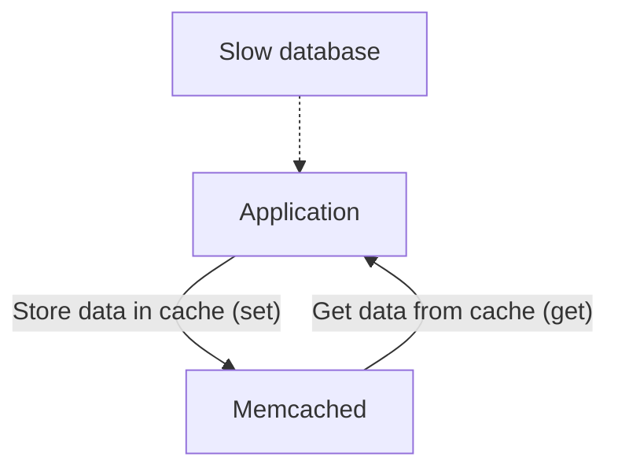

# Load balancing
# Caching (Cache)

1. Common caching services:
   - [Redis](https://redis.io/)
   - [Casandra](https://cassandra.apache.org/_/index.html)

2. CDN
3. Replication/Consistency

# Servers
1. Web Server
2. Database Server
   - Database Write
     Sharding: Split a database into multiple databases
     - Verticle Sharding: Each table into different machines
     - Horizontal Sharding: Deal with a single really large table. One technique is sharding the table based on row IDs
       - A master table is needed to store sharding 'ID'
       - for NoSQL Databases: Easy for scaling with Key-value structure
4. Media Server

# API
1. Client - Server
2. Data transport mechanism
   - Json
   - Protocol buffer
3. Security
4. Offline-Usage
5. Speed
