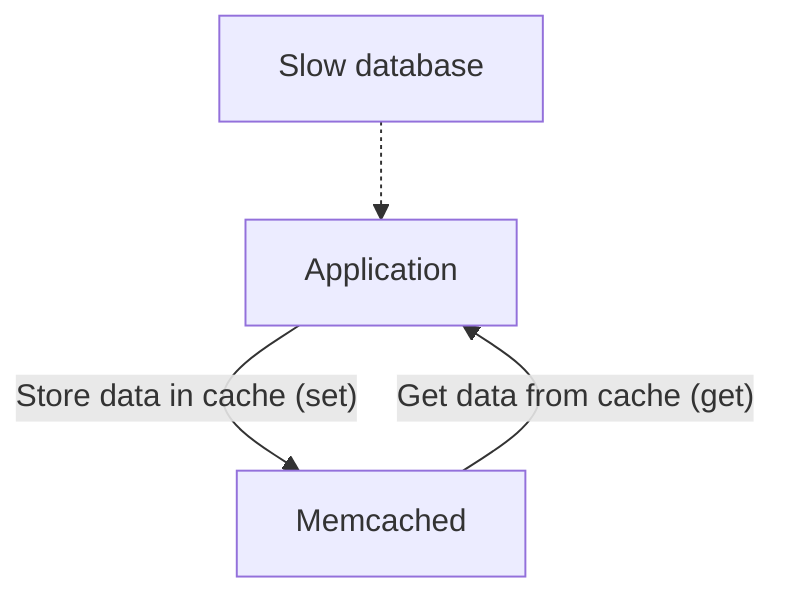

# Load balancing
# Caching (Cache)

1. Common caching services:
   - [Redis](https://redis.io/)
   - [Casandra](https://cassandra.apache.org/_/index.html)

2. CDN
3. Replication/Consistency

# Servers
1. Web Server
2. Database Server
   - Database Write
     Sharding: Split a database into multiple databases
     - Verticle Sharding: Each table into different machines
     - Horizontal Sharding: Deal with a single really large table. One technique is sharding the table based on row IDs
       - A master table is needed to store sharding 'ID'
       - for NoSQL Databases: Easy for scaling with Key-value structure
4. Media Server

# API
1. Client - Server
2. Data transport mechanism
   - Json
   - Protocol buffer
3. Security
4. Offline-Usage
5. Speed

# Algorithms
1. Consistence Hashing
   - e.g: Cassandra, redis, riak, DynamoDB
   - Fast. Suitable for data storage rather than web caching distribution
   [Consistence hashing paper](https://arxiv.org/pdf/1406.2294.pdf)
2. Geo Hash /Quad trees
   - Recursively subdividing 2D space into four quadrants. Each node represents a region and has 0-4 child nodes
   - Fast location based insertion and searches. Suitable for mapping app
   - Extend: R-trees, JD trees
3. Leaky bucket / Ray limiting
   - dataflow through 'leak', and turned away when overflowed until there's room again
   - Simple. Bucket size control burst capacity. Control leak rate.
   - Token bucket algorithm, Sliding windown counter algoritm
   - Trade off Accuracy-Perfomance
4. Tries
   - Tree of nodes
   - Fast looking speed
   - Foundation for scalable string based searches
5. Bloom Filter
   - Probabilistic data structure for set membership checks
   - " is W in the set?". Answer: Firm NO, or Probably YES
   - Less memory required, but less accurate
6. Consensus algorithms
   - Paxos, Raft
   - Simplicity, Efficiency
   - Prevent Downtime
   - e.g: Kafka, Etcd
